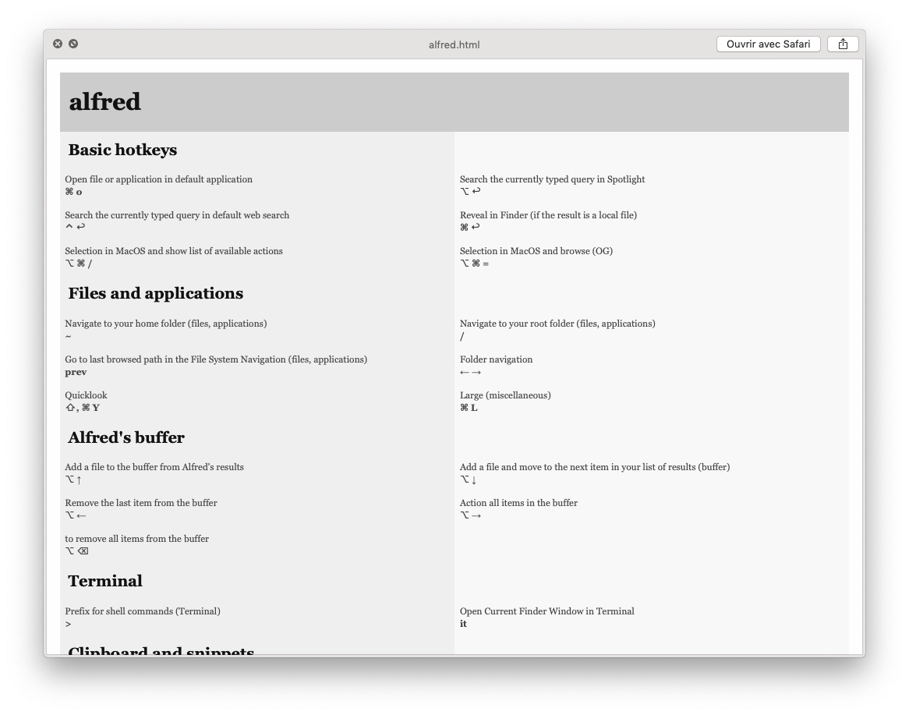

# Alfred-cheat  
This workflow is based on wx-Yao's original [Alfred-cheat](https://github.com/wx-Yao/alfred-cheat). It adds a few features, in particular a quicklook view.

It relies on deanishe's [Alfred-Workflow](https://www.deanishe.net/alfred-workflow/), and was initally inspired by [cheat](https://github.com/cheat/cheat). 

The moto is: write your own cheat sheets very simply and make them searchable using Alfred!

------

# Download via [release](https://github.com/odapg/alfred-cheat/releases)

# Demo


# How it works

1. Define a directory to store your cheatsheets.
2. Write your cheatsheet according to the very simple [rule](#rules) described below or download cheatsheet from [cheatsheet](https://github.com/cheat/cheatsheets)[^1] and put them in that directory. 
3. Tell the workflow where that directory is.

# Usage

- First,  specify your sheet directory (once for all) by using

  ​	 `cf <cheatsheet_folder>`
  You can use  absolute or relative path to specify `<cheatsheet_folder>`. 

Then, you're good to go:

- To list all your cheat: `cht`

- To search and list the content of one of your cheat: `cht <sheet_name>`. Fuzzy search and autocomplete is supported (thanks to [deanishe](https://www.deanishe.net)).

- To search in a specific sheet indexed by some keyword: 

  `cht <sheet_name> <keyword>`.

- To search across all your sheets for some keyword:

   `cht --search <keyword>`

- You can paste the selected record directly to the app you're using (e.g., Terminal) by hitting `↵`. 

- If you like to just copy, hit `⌘C`.

New!

- Open your cheatsheet file in your text editor by hitting `⌘↵`.

- See an item in large type by hitting `⌘L`.

- Open a quicklook view of your selection by either hitting `⇧` or `⌘Y`.

  

**Remark.** I changed wx-Yao's `cheat` keyword into `cht` because I find it quicker. But H.P. Lovecraft's fans can easily reverse this change.

# <a name="rules"></a>Parsing rule

The basic rule is very simple:

1. First the comment (preceded by `#`), then the command.

2. Separate each `comment, command` pair with 2 newlines (one newline visually).

Here is an example.

```
# This is a one line comment. 
Command one goes here.

# This is a second comment for the second command
# Yes we can have multiple line comment.
Command 2 goes here
And now you can also have two commands!

You can have commands without comments

# but no comments without command -- this is ignored

And remember to separate blocks by 2 newlines (1 visually)!
```

The above sheet will be parsed like this:


New!

- You can add *hidden blocks* in your file that will not appear in Alfred nor in the Quicklook view: simply begin the block by `/*`(no need to close the block)
- You can add *sections* that will not appear in Alfred but that will appear in the Quicklook view. Begin the block by `//`.

Example.

```
/* This is the beginning of my Alfred cheatsheet.
You can put unicode characters such as ⌘ or ⌥ without problem.

// Basic hotkeys 

#Open file or application in default application 
⌘ o

#Search the currently typed query in Spotlight 
⌥ ↩

#Search the currently typed query in default web search
⌃ ↩

#Reveal in Finder (if the result is a local file) 
⌘ ↩

// Files and applications

#Navigate to your home folder
~
```

This will give the following result in Quicklook.




**Remark.** Hidden cheatsheets (starting with `.`) as well as hidden directories are ignored. Hierachical structure is supported but that's only for your management purpose. This tool only "flattens" the hierarchy in the base directory. i.e., `cheat/somedir/otherdir/somecheat` will be equivalent to `cheat/somecheat` in its perspective. Also make sure you don't have duplicated cheatsheets in different directories otherwise only one of them will be dominant. 

# Compatibility

This workflow works without dependencies. It has been tested on **macOS 10.14.6 Mojave** with **Alfred 4**. Of course, you need the [powerpack](https://www.alfredapp.com/shop/) to get it working. It has not been tested on other systems. Report an issue if there's a problem.

# Contribution

Any idea of improvement is welcome. As for wx-Yao's original Alfred-cheat, I do not wish to add the feature of modifying cheatsheet right in Alfred because opening it in your text editor is much simpler and efficient.


------


[^1]: These may sometines need **very** small adjustments
